# Introduction

The current, incredible performance of AI models can be partially attributed to their compression capabilities. This compression is imposed on them by the architectural choices made by engineers. For example, GPT-2 had a vocabulary of 50,257 tokens, yet its "operational space" was only of size 768. In such a space only 768 directions can be described fully independently, so the model had to find strategies to efficiently store all 50,257 input tokens in this reduced space. In general, we call the phenomenon in which a model stores more features than it has dimensions **superposition**. However, superposition comes at a cost. At a given step of computation, models utilizing it have neurons that fire for multiple different inputs (so-called polysemantic neurons), which makes them hard to interpret.

One theoretical way around this problem would be to train models with no superposition at all. However, this is believed to greatly reduce their performance. Instead, we would like to better understand the phenomenon itself.

Prior work, [*Toy Models of Superposition*](https://transformer-circuits.pub/2022/toy_model/index.html) (Elhage et al., 2022), on two-layer ReLU networks with independent input features of equal importance and sparsity, suggests that the best geometries for storing the features are uniform polyhedra. In this work we study a similar problem, but with models involving a dedicated encoding layer followed by one or more multilayer perceptrons (MLPs) with a bilinear activation. Current frontier LLMs also use a dedicated encoder as the first step of their computation, so we believe this setup can serve as good groundwork for a better understanding of larger models.

Knowing the exact definition of the data-generating process, we give a theoretical solution to the problem and demonstrate that uniform polyhedra are not the best possible solutions: different, non-symmetric geometries perform better. Surprisingly, only deep models are capable of exploiting these better strategies, while shallow models default to the symmetric ones. We give evidence that the previous results, which suggest uniform geometries are the best for the stated task, stem from the architectural choices made by the engineers rather than from the task itself.

# Setup

We will be working with the following toy setup:
- The input to the models consists of 4 independent features of equal importance. Each feature is active with a small probability $p$ (in our experiments we use $p = 0.2$), so the distribution of the features can be formally described as

$$ x_i = b_i u_i, \quad b_i \sim \mathrm{Bernoulli}(p), \quad u_i \sim \mathcal{U}[0, 1]. $$

- The models consist of a linear encoder layer with a bottleneck compressing the input features to a 2D plane, followed by one or more MLPs with a bilinear activation function:

$$ \hat{x} = \mathrm{MLP}(\dots \mathrm{MLP}(\mathrm{Enc}(x)) \dots). $$

- The task is to minimize the mean squared error (MSE) of the model's reconstruction:

$$ \mathcal{L}_{MSE} = \mathbb{E}_x \Bigg[ \frac{1}{n} \sum_{i=1}^n (\hat{x}_i - x_i)^2 \Bigg]. $$

As will become clear later, for the purposes of interpretation it is useful to divide the models under study into two parts: we will refer to the first, linear layer as the encoder and to the subsequent MLPs as the decoder. This division will also help us derive the theoretical reconstruction floor imposed by the architectural constraints (going from a 4D space down to 2D and back to 4D). The model under study and the division point are shown below. The 2D plane at this point is where all the geometries presented throughout this work live.

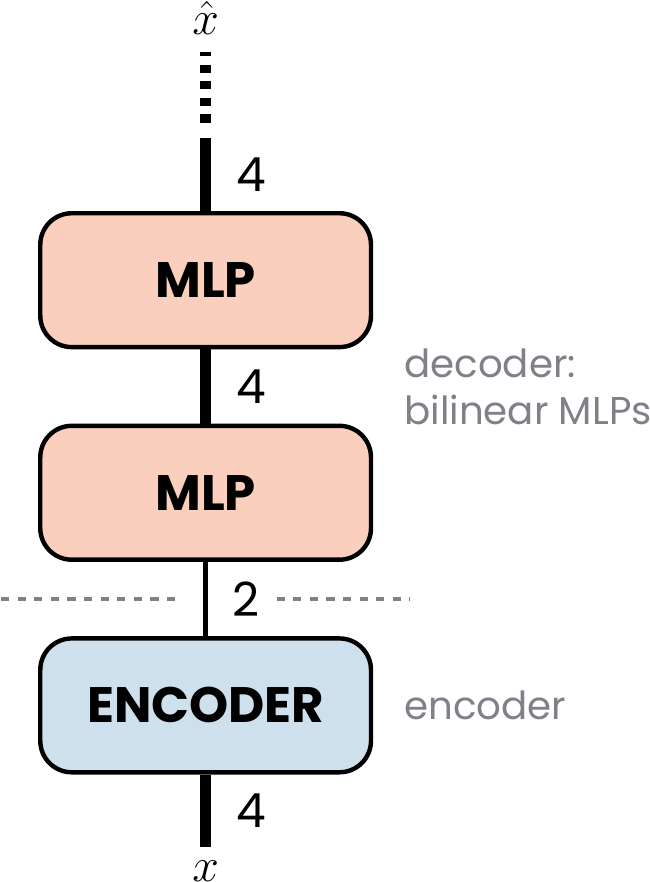

For completeness, we note that *Toy Models of Superposition* used a similar architecture on this very task. For 4 features compressed to a 2D space, it consists of a linear encoder given by a $2 \times 4$ matrix $W$, followed by a decoder that applies the transpose of the same matrix, $W^T$, a bias, and finally a ReLU activation. Because the same weight matrix $W$ is used in both layers, we will refer to this case as ***tied ReLU***.

# Theoretical solution

In this section we will introduce a simple, symmetric geometry that a theoretical encoder can implement, and provide a closed-form description of a decoder whose goal is to reconstruct the network's input from the point in the 2D plane that the encoder maps it to.

We will then present two strategies the encoder can employ to lower the reconstruction error, and finally demonstrate how these two techniques can be used in tandem to obtain the true best solution. This solution will serve as the theoretical reconstruction floor against which we will later compare the behavior of the actual models under study.

## Symmetrical antipodal encoding

The simplest way for the encoder to arrange the embeddings of the 4 input features on the 2D plane is as two antipodal pairs. The embeddings of each pair lie on a common line, pointing in opposite directions. The two lines are orthogonal, which allows the pairs to be analyzed independently, and their orientation is otherwise arbitrary. Below we show an example, where we have simply chosen the basis axes as the pair lines. Here $f_i \in \mathbb{R}^2$ denotes the **embedding** of feature $i$, the $i$-th column of the encoder matrix, so that the encoder's output, the **reading** seen by the decoder, is $\mathrm{Enc}(x) = \sum_{i=1}^4 x_i f_i$.

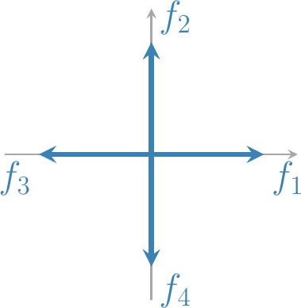

Let us focus for now on the horizontal line segment between $f_3$ and $f_1$; a reading on it is described by a single coordinate $s = x_1 - x_3 \in [-1, 1]$. We will use this segment to understand the interaction between the introduced encoder and a theoretical decoder through two lenses: (i) knowing the distribution of the features exactly, and (ii) having access only to an "oracle" that gives us samples of the data with no description of the underlying distribution. In both analyses we assume that the loss function, the MSE defined above, is known.

### Closed-form decoder from the known distribution

Knowing the distribution of the input features, we can distinguish four cases that result in a reading on this segment (as a reminder, we use the probability of a feature being active $p = 0.2$ throughout this work):
1. neither feature active, with probability $(1-p)^2 = 0.64$,
2. feature 1 alone active, with probability $p(1-p) = 0.16$,
3. feature 3 alone active, with probability $(1-p)p = 0.16$,
4. both features 1 and 3 active, with probability $p^2 = 0.04$.

This encoding method has one huge caveat. In the fourth case, with both features co-active, the reading can land anywhere on the segment (except for the endpoints $f_1$ and $f_3$ themselves). Because of that, even a perfect decoder cannot distinguish this case with full confidence from one in which only a single feature, or none, was active.

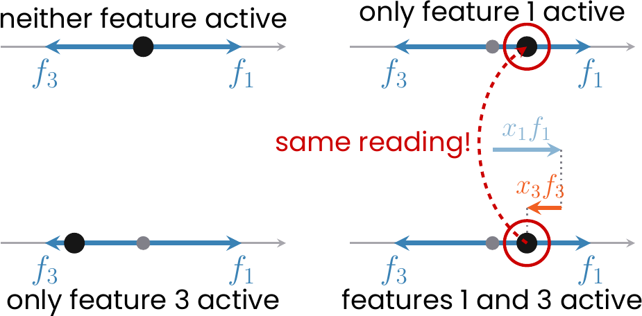

Because of this information loss the decoder needs to average between different plausible scenarios to give the best possible response (measured with MSE).

Below we present the formula for such a theoretical decoder reconstructing the first feature, when given a reading at position $s$ on the segment (the derivation of this formula is presented in the Appendix).

$$ \hat{x}_1(s) = \mathbb{E}[x_1 \mid s] = \begin{cases} \dfrac{p\,(1+s)^2}{2\,(1+ps)} & -1 \le s < 0, \\[2ex] 0 & s = 0, \\[1ex] \dfrac{2(1-p)\,s + p\,(1-s^2)}{2\,(1-ps)} & 0 < s \le 1. \end{cases} $$

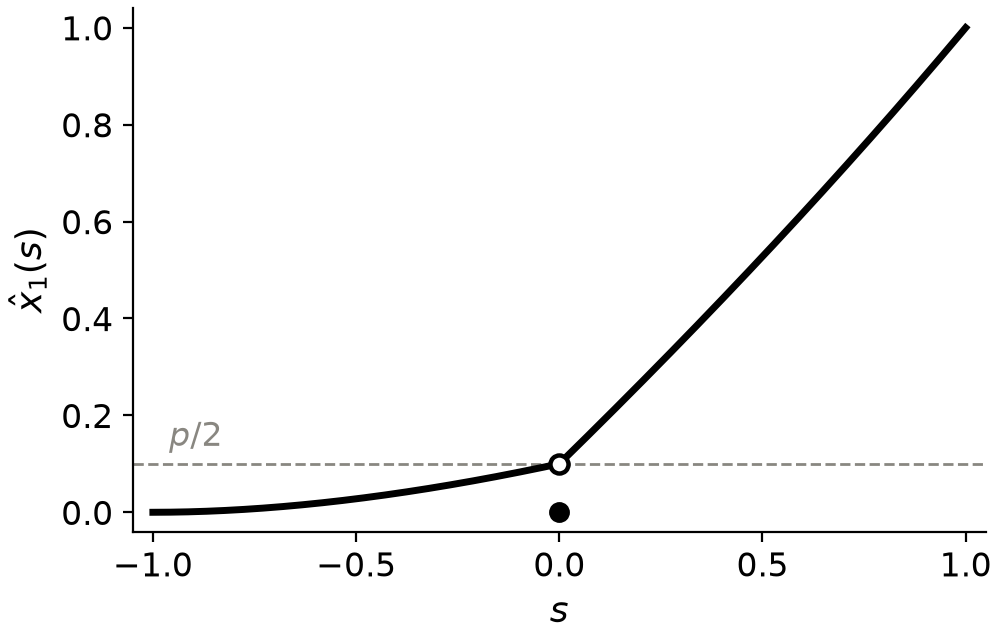

The decoder for the third feature is simply the mirror image of the curve above, $\hat{x}_3(s) = \hat{x}_1(-s)$, so we can picture the two decoders on the same plot:

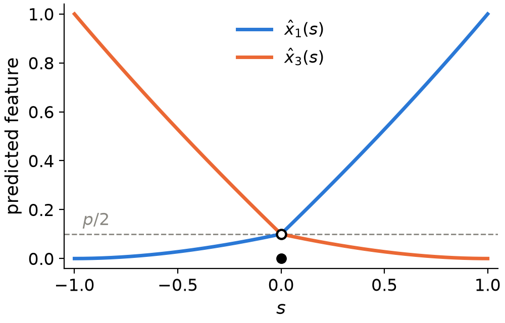

### Decoder from data samples alone

The above derivation was possible only because we knew the underlying distribution of the features. Now, let us try to obtain similar results while having access only to an "oracle" that gives us raw samples of the data (which is closer to a real-world situation).

Having samples of the data, we can also visualize them along our line segment:

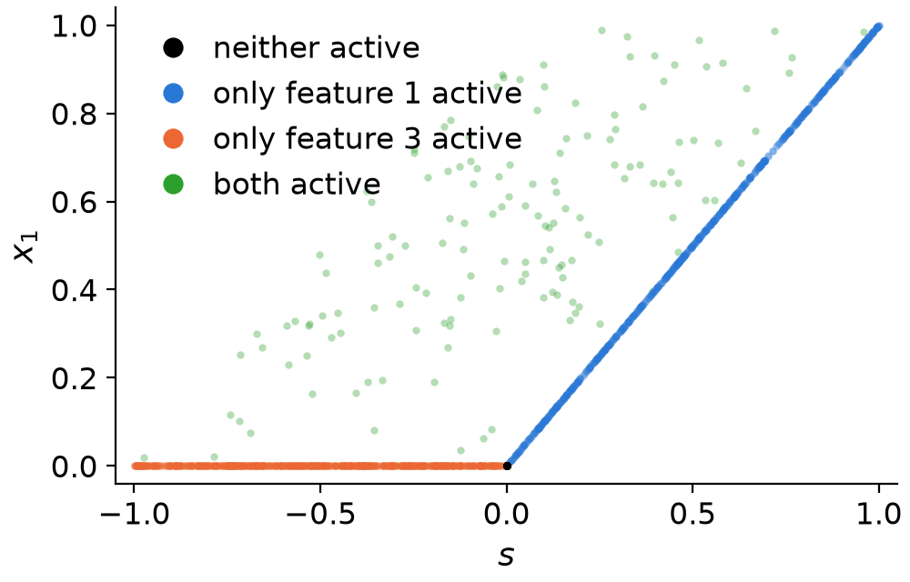

The above plot can make it more explicit that without the case of co-active features the best possible solution would be to use a ReLU function.

Now, how can we accomodate for the fact that there are situations in which different features are co-active? To do that we need to look at the definition of the loss function we are using.

In our setup the loss is the MSE. Let's consider all the samples that produce the same reading $s$. The decoder has to output one number for all of them, and its performance is measured by the squared distance from that number to each sample's true $x_1$. The number that minimizes the total squared distance to a set of values is their arithmetic mean, so the best decoder outputs the mean of $x_1$ over the samples with reading $s$.

So, the choice of the mean thus comes from the loss, not from the data. If we chose the mean absolute error instead, the best output would be the median of the same set of values, and with a 0–1 loss its most frequent value (the mode).

However, having a finite number samples we cannot take the mean over "all samples with reading $s$" literally, because no two samples have the same reading. Instead we split the line segment into very small intervals (bins), gather the samples whose reading falls into each, and average their $x_1$. The result is a step function approximating the closed-form curve, and it converges to it as we take more samples and narrower bins. Below we present the result of such an average computed on the data samples shown above:

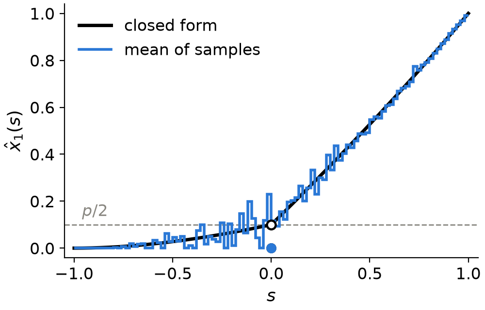

Having introduced the two methods of obtaining the best possible decoder depending on the context we are in, we now move on to the strategies, which can be applied to modify the initial encoder and increase the performance of the model as a whole.

## Asymmetrical antipodal encoding

The first modification is very simple: we make one of the embeddings shorter than the other.

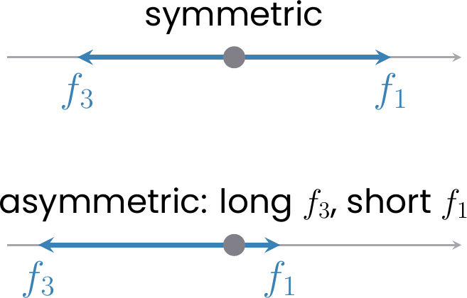

This has a rather counterintuitive outcome. With this change the prediction error is "poured" into the reconstruction of a single feature; however, measured over both features, the total error turns out to be smaller!

Below we compare the two encodings. In the asymmetric one, $f_1$ is shortened and $f_3$ lengthened so that $|f_3|$ is $4.25$ times $|f_1|$. The first two panels show the closed-form decoders for both features, and the third the MSE these decoders achieve, split into the contributions of the two features.

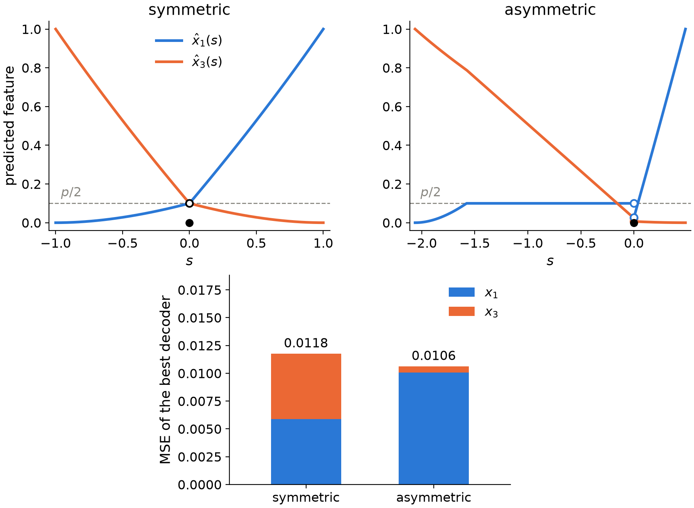

Is it then always better to make the pair more asymmetric? To check this, we sweep the length ratio $|f_3| / |f_1|$ from $1$ to $100$ and compute, for each value, the MSE of the best decoder, both in closed form and from binned samples. In the binned case the segment is divided into bins of equal width and every feature gets its own decoder, which predicts the feature's mean value over the samples that land in the same bin. In both cases, as in the previous figure, we report the sum of the two features' MSEs rather than their average.

The closed-form curve first falls, because the error of the lengthened feature vanishes faster than the error of the shortened one grows, but it flattens out at a ratio of about $3$–$4$ (a minimum of $0.0106$ at $3.4$, against $0.0117$ for the symmetric pair) and then slowly rises again, toward $0.0113$: beyond this point the shortened feature is essentially unreadable whenever its partner is active, and its error dominates the total. Asymmetry therefore helps only up to a moderate ratio, and the optimum is shallow. A binned decoder has its minimum at the same ratio ($3.2$–$3.6$ for the three resolutions), but is stricter beyond it: once the short embedding becomes comparable to the width of a bin, the readings of the short feature on its own are no longer resolved, and the MSE climbs steeply, the earlier the coarser the bins (with $50$ bins the symmetric pair is better again above a ratio of $13$, with $400$ bins above $89$).

## "Opening" the antipodal pairs

Another modification boils down to slightly tilting one of the embeddings of a pair with respect to its partner. With this strategy the case of no active features still lands at the origin, and each feature active on its own still lands on its embedding vector, but the co-active case moves off the line into the interior of the parallelogram spanned by the two embeddings.

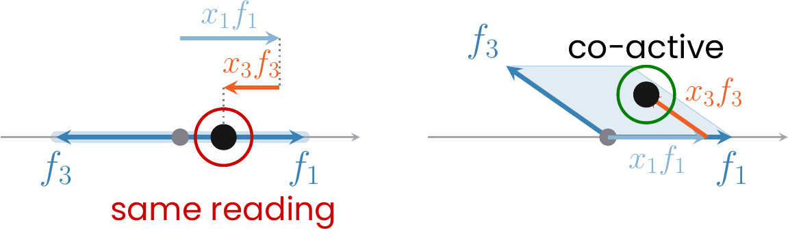

This allows the decoder to distinguish features that are active on their own from co-active ones, which results in better reconstruction performance. In fact, a decoder of infinite resolution would be able to distinguish the co-activation at an arbitrarily small opening angle, since the co-active readings leave the line as soon as $\varepsilon > 0$.

However, trained models have finite resolution. Below we investigate its effects by studying what a binned decoder is actually capable of. We keep the length ratio of both pairs equal to $1$, tilt $f_3$ off the antipode of $f_1$ by $\varepsilon$, keep the other pair closed, and score every $\varepsilon$ with binned decoders of three resolutions. The bins are now square cells covering the 2D plane of readings, and again every feature gets its own decoder, which predicts the feature's mean value over the samples that land in the same cell. Since all four features are now involved, we report the MSE as defined in the Setup, i.e. averaged over the four features.

The MSE has its minimum at a finite opening, which moves toward zero as the bins get finer. But why does the MSE not stay constant once $\varepsilon$ surpasses this threshold for a given binning? This is because opening one pair makes it interfere with the readings of the other pair. We will study this in more depth in the next section.

## Search for the best strategy

We close this section by investigating what is in fact the best strategy for a linear encoder followed by a decoder that is restricted to no particular function class and is limited only by the resolution of the bins used to compute it.

We do this by a free search over the encoder geometry. For an unconstrained decoder the angle between the two pair lines does not matter, so we may pin two of the embeddings to the axes and let the remaining two be arbitrary vectors in the plane, described by their angle and length. Every geometry is scored by the MSE of a decoder obtained numerically, as in "Decoder from data samples alone" but with two-dimensional bins. The four parameters are optimized by a random search followed by local descent.

Below we present the geometry obtained by the above search along with regions indicating the co-occurrence of various feature pairs.

The search finds that the two free embeddings settle almost antipodal to the pinned ones, much shorter than them, and slightly tilted, each toward the long embedding of the other pair. The $(f_1, f_3)$ pair is opened by $20.7^\circ$ with a length ratio $|f_3| / |f_1| = 13.5$, and the $(f_2, f_4)$ pair by $20.4^\circ$ with $|f_4| / |f_2| = 13.0$, reaching an MSE floor of $0.00221$ per feature, against $0.0056$ for the closed symmetric pairs decoded at the same resolution ($96 \times 96$ bins).

Surprisingly, the length ratio found by the search is far larger than the $3$–$4$ that was optimal for a closed pair, for the binned decoders just as for the closed form. However, this is not a contradiction. The limiting factor in the closed pair case was that the two readings still occupied the same 1D line segment, so whenever two features were co-active, their contributions were mixed together. The moment one of the features is tilted, the co-active case moves into the interior of the parallelogram and can be distinguished by the decoder. But, as mentioned before, this comes at the price of interfering with the features of the second pair, and the best solution of finite resolution accommodates for that by shrinking the feature even more.

To check that this is indeed what sets the ratio, we repeat the asymmetry sweep on the opened geometry: both pairs opened by the angles found by the search ($20.7^\circ$ and $20.4^\circ$), the length ratio of both swept from $1$ to $100$, and every value scored by the same binned decoders as in the previous section. If shrinking the short embeddings really pays for the interference, the minimum should now lie well beyond the $3$–$4$ of the closed pair, and should move further out as the bins get finer, since it is the resolution that stops the shrinking. This is what we find: the minimum sits at a ratio of about $4.5$ with $24$ bins per axis, $5.6$ with $48$ and $6.3$ with $96$. For the finest binning, the MSE stays within $5\%$ of its minimum up to a ratio of $13$, which explains the result obtained by the search. 

# A model's strategy depends on its depth

Knowing what a good strategy is under the general constraints, let us now turn to what the trained models actually do. Below we present representative geometries of models with one and with four bilinear layers.

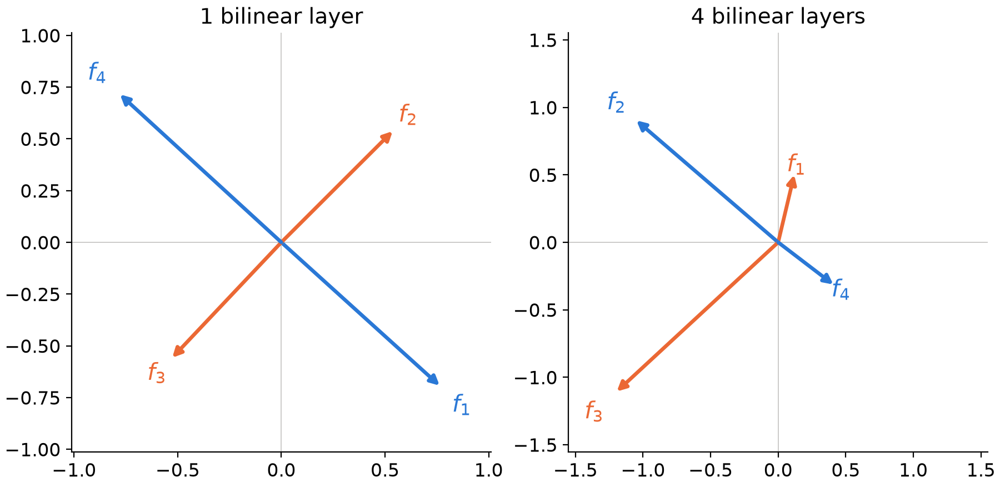

To make sure the above results are not an accident, we conducted 20 training runs for each depth, from 1 to 4 bilinear MLP layers, as well as for the tied ReLU model, and checked which strategy each trained model uses:

| model | symmetric pairs | asymmetric pairs | asymmetric + opened pairs | other |
|---|---|---|---|---|
| tied ReLU | 19 | 0 | 0 | 1 |
| 1 bilinear layer | 19 | 0 | 0 | 1 |
| 2 bilinear layers | 0 | 16 | 2 | 2 |
| 3 bilinear layers | 0 | 5 | 14 | 1 |
| 4 bilinear layers | 0 | 4 | 10 | 6 |

It turns out that the opening of a feature pair never appears on its own, which is why the table has no separate "opened pairs" column.

These results clearly show that models with a single bilinear MLP default to symmetric antipodal pairs, and so does the tied ReLU model. Only models with more bilinear MLPs start to use the strategies introduced in the previous section. Why is that? It turns out to boil down to the expressivity of the function class each model can implement.

We can understand this using the benchmark from the previous section.

## The symmetric vs. asymmetric trade-off

Let us first focus on the trade-off between symmetric and asymmetric pairs. We can plot the unconstrained decoders $\hat{x}_i(s)$ for both choices of the feature embeddings and approximate them with functions $\hat{x}_i'(s)$ of different complexity, corresponding to the model classes we are studying.

The decoder implemented by a model with a single bilinear MLP is a quadratic function. As we can see below, it cannot match the asymmetric benchmark properly, so the model defaults to the symmetric one, which results in a smaller MSE.

The decoder of a model with four bilinear layers is far more expressive, because it is a polynomial of degree 16. Such a function can properly approximate both the symmetric and the asymmetric embedding, so the model chooses the asymmetric one, which results in a smaller loss.

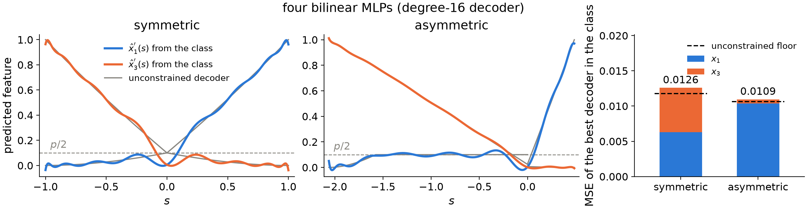

Finally, the tied ReLU model faces the same challenge as the model with a single bilinear MLP. It cannot approximate the asymmetric case well, so it also settles on the symmetric solution.

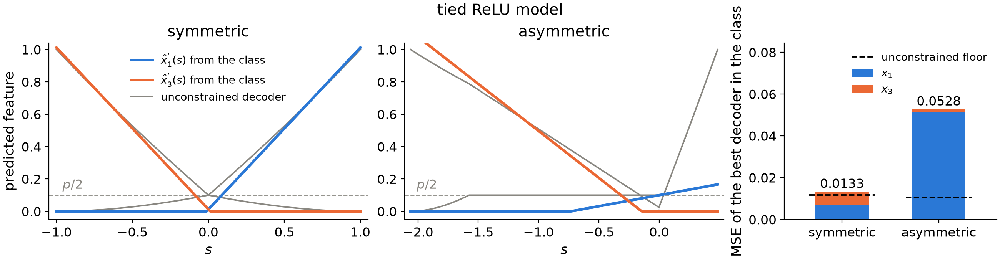

## Detecting the opening of a pair

We have found that the symmetric vs. asymmetric trade-off comes down to the expressivity of the function class each model can implement. A similar argument explains why some models open their pairs while others do not.

As before, we fix the encoder, this time with one pair slightly opened: $f_3$ is tilted by $25^\circ$ away from the antipode of $f_1$, while the other pair stays closed. The readings of co-active features 1 and 3 now fill the thin parallelogram between $f_1$ and $f_3$, shown in orange below, whereas all other co-active pairs fill the much larger light-blue ones.

To see what such an encoding demands of the decoder, we cut the plane along a line crossing the orange parallelogram and follow the reconstruction of feature 3 along the cut. Outside the strip, a reading on the cut can only come from other combinations of features, so the best decoder reports feature 3 as inactive. Inside the strip, feature 3 is co-active with feature 1, and the decoder should raise its estimate accordingly. The unconstrained decoder is therefore a narrow spike over the strip.

Below we compare it with the best fits from the function classes of our models. The tied ReLU, quadratic and quartic decoders barely react to the strip at all. The degree-8 decoder of the model with three bilinear MLPs responds with a bump, but a broad one that spills far beyond the strip, so it captures only part of the benefit. This is nevertheless enough for opening to pay off, which is consistent with the table above, where models with three bilinear MLPs are the first to open their pairs in most runs. Only the degree-16 decoder of the model with four bilinear MLPs approximates the spike well. Opening a pair therefore brings no benefit to shallow models, which is why they keep their pairs closed, while deeper models can read the strip and profit from it.

# How well do the models approximate the best decoder?

We have given indications of why the models may or may not use different strategies to improve their performance in superposition. But how close do the trained models actually come to these theoretical results?

Below we present the binned decoders for all four features, which the model with a single bilinear MLP is supposed to reconstruct.

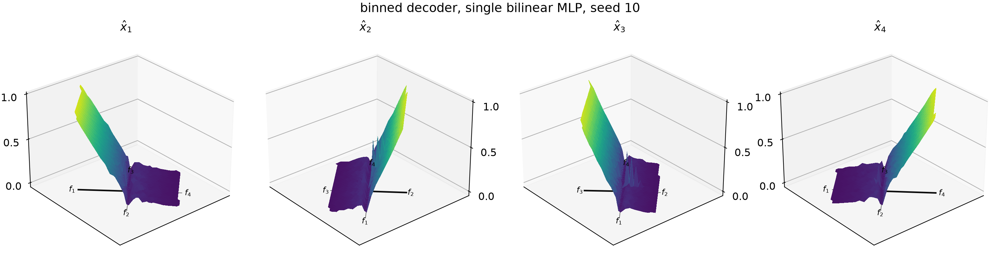

Next, we show the best quadratic approximation of these binned decoders.

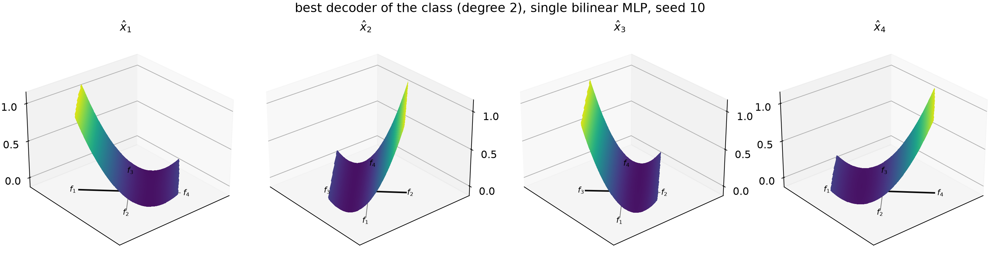

Finally, we show the difference between what the model has actually learned and this best decoder of its class. For the model with a single bilinear MLP the difference is surprisingly small!

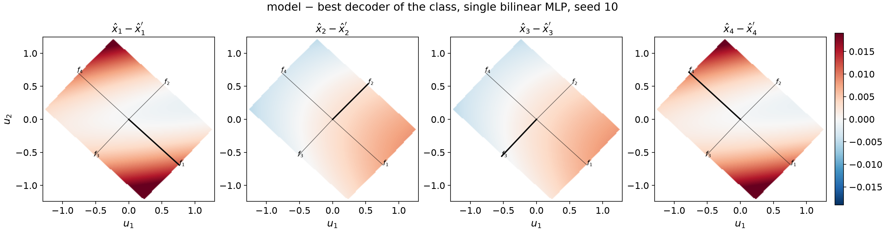

The analogous results for the model with four bilinear MLPs are presented below. In this case the difference between the trained model and the best fit in its class is much larger than for the single-MLP model. We attribute it to a training run that is too short for the deeper model (both models were trained for 20,000 steps).

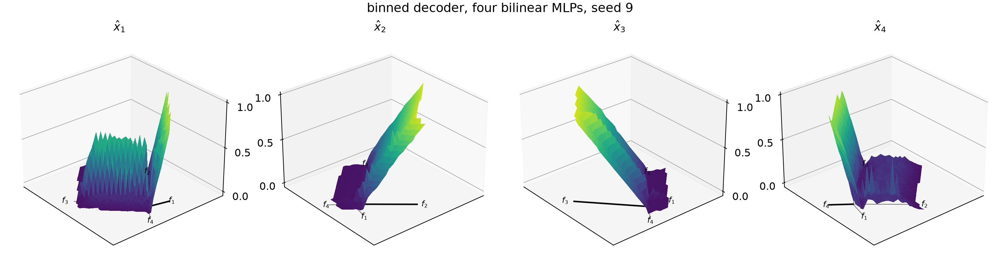

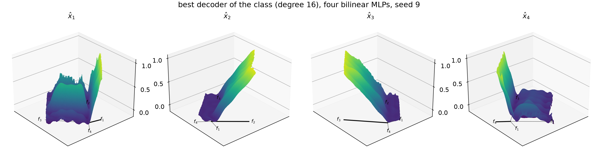

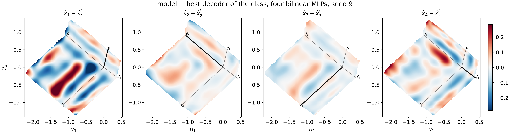

To take a closer look, we cut the reading plane of each model along the line of its longest embedding and follow the reconstruction of that feature along the cut. The shallow model traces the best quadratic exactly, while the deeper model visibly departs from the best polynomial of degree 16. Here, too, the difference between the deeper model and the best solution in its class is larger than for the shallow one.

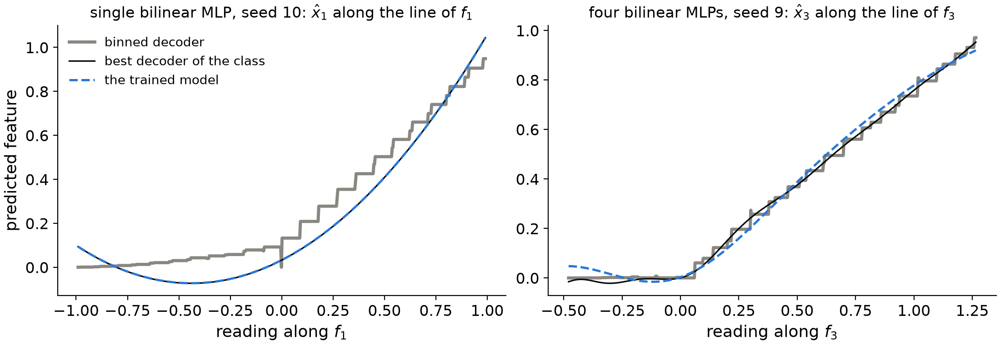

Finally, we define two measures to put numbers on these observations:
- The *MSE gap* $= (\mathrm{MSE}_{\text{model}} - \mathrm{MSE}_{\text{class}}) / \mathrm{MSE}_{\text{model}}$ is the fraction of the model's error that it could still remove by becoming the best decoder of its class. It is equal to zero when the model already is that decoder.
- The *score* $= 1 - \mathbb{E}\|\hat{x} - \hat{x}'\|^2 / \mathrm{Var}(\hat{x})$ is the fraction of the variance of the model's outputs that the best decoder of its class explains. It is one when the two functions coincide, and it would be zero if the best decoder of the class were no better at predicting the model's outputs than a constant.

| model | MSE, binned decoder | MSE, best of the class | MSE, trained model | MSE gap | score |
|---|---|---|---|---|---|
| single bilinear MLP | 0.0059 | 0.0093 | 0.0093 | 0.1% | 0.9998 |
| four bilinear MLPs | 0.0043 | 0.0045 | 0.0058 | 21.9% | 0.975 |

These results underline once more that the shallow model is essentially the best approximation of the binned decoder that its class allows, while the deeper model comes close to it, but not as close as the shallow one.

# Summary

We have demonstrated that uniform polyhedra are not inherently the best solution to the task of reconstructing independent features of equal importance and sparsity. The earlier indications that they might be stem from the architectural choices made by the engineers rather than from the task itself.

We have shown two strategies that models can employ to improve on the simple symmetric antipodal embedding of the features: making the embeddings of a pair asymmetric and slightly tilting one of them. Only deeper models can use these strategies, because only their expressivity allows for it.

Finally, we have shown that shallow models are essentially the best possible approximations of the theoretical binned decoders within their class, while deeper models diverge slightly from the best approximation in theirs. We suspect that this is the result of a training run that is too short, which a longer one would resolve.

# Appendix: derivation of the closed-form decoder

We derive $\hat{x}_1(s) = \mathbb{E}[x_1 \mid s]$ for the symmetric antipodal pair, where $s = x_1 - x_3$. Recall that each feature is inactive (equal to $0$) with probability $1 - p$ and otherwise uniformly distributed on $[0, 1]$, independently of the other.

The best guess at a reading $s$ is the average of $x_1$ over all the ways of producing that reading, each way weighted by how likely it is. The case of neither feature active produces exactly $s = 0$ and nothing else, so $\hat{x}_1(0) = 0$. The remaining three cases produce readings $s \neq 0$:

- **Feature 1 alone** (probability $p(1-p)$). The reading is $s = x_1$, so $x_1 = s$. Since $x_1$ is uniform on $[0, 1]$, this case is equally likely to produce any $s \in (0, 1]$: its weight is $p(1-p)$.
- **Feature 3 alone** (probability $p(1-p)$). The reading is $s = -x_3$ and $x_1 = 0$. Equally likely for any $s \in [-1, 0)$: weight $p(1-p)$.
- **Both active** (probability $p^2$). The reading is $s = x_1 - x_3$. The pairs $(x_1, x_3)$ that produce a given $s$ form a diagonal segment of the unit square, whose length is proportional to $1 - |s|$: readings near $0$ are easy to produce (any $x_1 \approx x_3$ will do), readings near $\pm 1$ need one feature near $1$ and the other near $0$. The weight is therefore $p^2 (1 - |s|)$. All points of the segment are equally likely, so the average of $x_1$ over it is the midpoint between its smallest and largest value. Since $x_1 = x_3 + s$ with $x_3$ between $0$ and $1$: for $s > 0$ the smallest $x_1$ is $s$ (at $x_3 = 0$) and the largest is $1$ (at $x_3 = 1 - s$, beyond which $x_1$ would exceed $1$), so the average is $\frac{s + 1}{2}$; for $s < 0$ the smallest $x_1$ is $0$ (at $x_3 = |s|$, below which $x_1$ would be negative) and the largest is $1 + s$ (at $x_3 = 1$), so the average is $\frac{0 + (1 + s)}{2}$. In both cases this is $\frac{1+s}{2}$.

For $0 < s \le 1$ the reading can come from "feature 1 alone" or from "both":

$$ \hat{x}_1(s) = \frac{p(1-p)\, s + p^2 (1-s)\, \frac{1+s}{2}}{p(1-p) + p^2 (1-s)} = \frac{2(1-p)\, s + p\,(1 - s^2)}{2\,(1 - ps)}. $$

For $-1 \le s < 0$ it can come from "feature 3 alone", which contributes $x_1 = 0$, or from "both":

$$ \hat{x}_1(s) = \frac{p^2 (1+s)\, \frac{1+s}{2}}{p(1-p) + p^2 (1+s)} = \frac{p\,(1+s)^2}{2\,(1 + ps)}. $$

Together with $\hat{x}_1(0) = 0$ this is the formula of the main text.
